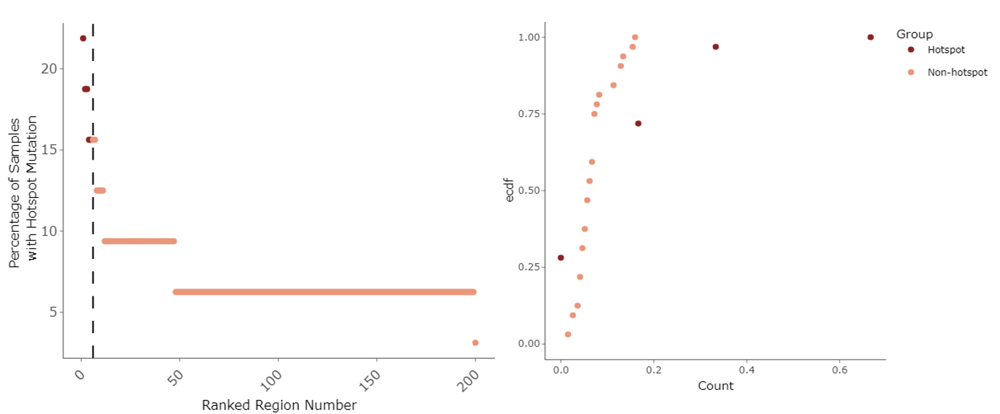

## Table of Contents
1. [Introduction](#introduction)
2. [Installation & Setup](#load_package)
3. [Dataset Formatting](#format_data)
  1. [Mutation Data](#mutation_data)
  2. [Genomic Regions](#region_data)
4. [compSPOT Functions](#functions)
  1. [Identifying Mutation Hotspots](#sig.spot)
  2. [Comparison of Mutation Hotspots Between Group](#group.spot)
  3. [Exploratory Data Analysis of Mutated Regions and Personal Risk Factors](#feature.spot)


## Introduction to compSPOT <a name="introduction"/>

Clonal cell groups share common mutations within cancer, precancer, and even clinically normal appearing tissues. The frequency and location of these mutations may predict prognosis and cancer risk. It has also been well established that certain genomic regions have increased sensitivity to acquiring mutations. Mutation-sensitive genomic regions may therefore serve as markers for predicting cancer risk. This package contains multiple functions to establish significantly mutated hotspots, compare hotspot mutation burden between samples, and perform exploratory data analysis of the correlation between hotspot mutation burden and personal risk factors for cancer, such as age, gender, and history of carcinogen exposure. This package allows users to identify robust genomic markers to help establish cancer risk.


## Installation & Setup <a name="load_package"/>


``` {r install package}
if (!require("BiocManager", quietly = TRUE))
  install.packages("BiocManager")                                                                      BiocManager::install("compSPOT")
```

``` {r load library}
library(compSPOT)
```

## Formatting of Input Data <a name = "format_data"/>

### Mutation Data <a name = "mutation_data"/>

The mutation dataset should include the following columns:
"Chromosome" <-- Chromosome number where mutation is located
"Position" <-- Genomic position number where mutation is located
"Sample" <-- Unique ID for each sample in dataset
"Gene" <-- Name of gene which mutation is located in (optional)
"Group" <-- Group classification ID (group.spot only) 
Clinical Parameters <-- (for feature.spot only) 


Table 1: Example structure of input mutation dataset.

### Genomic Regions <a name = "region_data"/>

The regions dataset should include the following columns:
"Chromosome" <-- Chromosome number where region is located
"Lowerbound" <-- Genomic position number where region begins
"Upperbound" <-- Genomic position number where region ends
"Gene" <-- Name of gene which mutation is located in (optional)
"Count" <-- Number of mutations in mutation dataset which are found within region (optional)


Table 2: Example structure of input genomic regions dataset.

``` {r load data}
data("mutation_data")
data("region_data")
```

## compSPOT Functions <a name = "functions"/>

The compSPOT package contains three main functions for (1) selection of mutations hotspots
(2) comparison of hotspot mutation burden between groups, and (3) comparison of mutation hotspot
enrichment based on clinical and personal risk factors. All functions return both numerical outputs
based on analysis summary and data visualization components for quick and easy interpretation of results.

### Identifying Mutation Hotspots with sig.spot <a name = "sig.spot"/>

Our previously published Bioconductor package seq.hotSPOT (doi: 10.3390/cancers15051612) identifies highly mutated genomic regions based on SNV datasets. While this tool can identify long lists of mutated regions, we sought to establish a method for identifying which of these genomic regions have significantly higher mutation frequency compared to others and may be used as markers of carcinogenic progression.


Methods: This function begins by measuring the mutation frequency for each unique sample for each provided genomic region. Beginning with the top ranked hotspot, a Kolmogorov-Smirnov test is preformed on the mutation frequency of the top genomic region compared to the normalized mutation frequency of all the lower-ranked regions. This continues, then running the Kolmogorov-Smirnov test for the normalized mutation frequency of the top 2 genomic regions compared to the normalized mutation frequency of all lower-ranked regions. This process repeats itself, continuously adding an additional genomic regions each time until either the set p-value or empirical distribution threshold is not met. Once this cutoff has been reached, an established list of mutation hotspots is provided.



Figure 1: Example output plots from sig.spot function. Dot plot (left) indicates the mutation frequency for each genomic region. Regions which were found to be significantly mutated are shown in dark red, while non-significantly mutated regions are shown in pink. Vertical line indicates the cutoff point of significantly mutated hotspots. Empirical Cumulative Density Function plot (right) indicates the shift in mutation frequency per sample in comparison between mutation hotspots and non-hotspots.

### Comparison Mutation Hotspot Burden with group.spot <a name = "group.spot"/>

Previously, we have shown mutation hotspots identified using seq.hotSPOT may be used to differentiate between samples with history of frequent vs infrequent carcinogen exposure (doi: 10.3390/cancers15051612, doi: 10.3390/ijms24097852). group.spot provides an automated approach for statistical and visual comparison between mutation enrichment of different groups of interest.


Methods: This function creates a list of mutation frequency per unique sample for each genomic region separated based on specified sub-groups. The regions with significant differences in mutation distribution are calculated using a Kolmogorov-Smirnov test. The difference in mutation frequency is output in a violin plot.


Figure 2: Example output plot from group.spot function. 

### Exploratory Data Analysis of Mutation Hotspot Burden and Personal Risk Factors with feature.spot <a name = "feature.spot"/>

Mutation enrichment in cancer mutation hotspots has been shown to relate to personal cancer risk factors such as age, gender, and carcinogen exposure history and may be used in combination to create predictive models of cancer risk (doi: 10.3390/ijms24097852). feature.spot provides a baseline analysis of any set of clinical features to identify trends in the enrichment of mutations and personal risk factors.

Methods: This function first classifies the features into sequential or categorical features. Sequential features are compared to the mutation count using Pearson Correlation. Similarly, in categorical features Wilcox Rank Sum and Kruska-Wallis Tests are used to compare groups within the features based on their mutational count. 


Figure 3: Example output from feature.spot. An array of plots is given based on each provided feature. Features with continuous data are represented by scatter plots, while features with categorical data are represented with violin plots. Outcome from statistical analyses are displayed on each respective plot.


